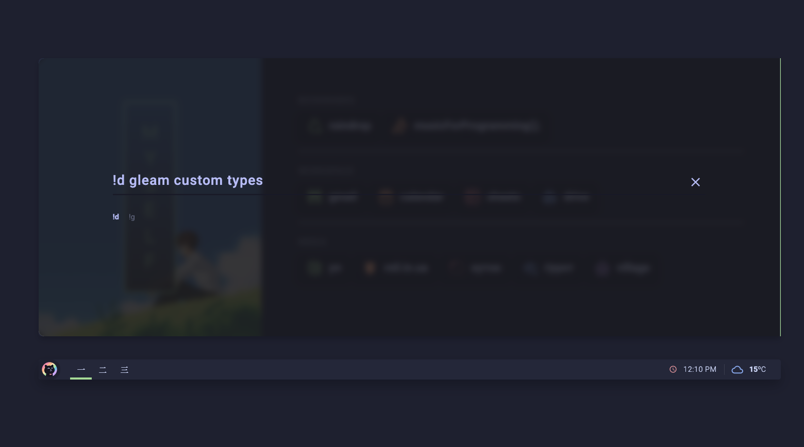
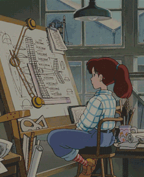
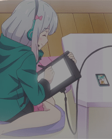
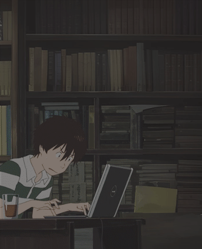
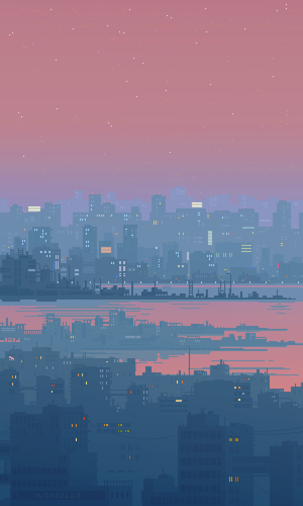
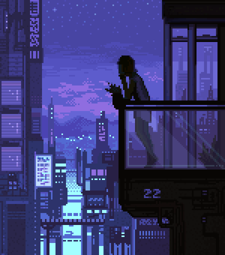

<h3 align="center">
   
  
  Catppuccin <a href="https://pivoshenko.github.io/catppuccin-startpage">Startpage</a>
  
</h3>

  
  
  

  

# 🪴 Overview

A minimalistic and customisable startpage featuring the [**Catppuccin palettes**](https://catppuccin.com/palette). Designed for both aesthetics and functionality, with seamless hosting on GitHub Pages. This startpage is based on [`dawn`](https://github.com/b-coimbra/dawn), which offers additional functionality. I have refined the page to match my [`dotfiles`](https://github.com/pivoshenko/dotfiles); feel free to explore them as well.

## 🧠 Main Principles

- Minimalism in all aspects
- Consistency throughout the user interface and codebase
- Simplicity in design and configuration
- Unified style and reduced visual noise

## 🎨 Supported Palettes

- Latte
- Frappé
- Macchiato
- Mocha

# 🪵 Usage

1. Fork this repository and clone it
2. Optionally remove the `.github` directory, as it contains only PR templates, issue labels, etc., that are linked to this repository
3. Update [`userconfig.js`](userconfig.js):
   - Set the desired palette: `latte / frappe / macchiato / mocha`
   - Set your location for the weather widget
   - Update the number of tabs and their banners
   - Update bookmarks and quick links for those you use most

> [!TIP]
> You can find icons for your bookmarks using [`tabler-icons`](https://tabler.io/icons).
>
> To reduce icon loading times, you may install the icon [font](src/fonts) locally and activate the option `"localIcons": true` in the configuration to disable remote styles.

### As Homepage

- Click the menu button and select `Options/Preferences`
- Click the home panel
- Click the menu next to 'Homepage and new windows', choose to show custom URLs, and add your GitHub Pages link

### As New Tab

You can use different add-ons or extensions for this.

- If you use Firefox-based browsers: [Custom New Tab Page](https://addons.mozilla.org/en-US/firefox/addon/custom-new-tab-page/?src=search) and make sure to enable "Force links to open in the top frame (experimental)" in the extension's preferences page
- If you use Chromium-based browsers (Brave / Chrome): [Custom New Tab URL](https://chrome.google.com/webstore/detail/custom-new-tab-url/mmjbdbjnoablegbkcklggeknkfcjkjia)

## 🔎 Search

  

The search dialogue allows you to display a search bar with various search engines defined in the configuration. To select each one, simply prefix the query with the corresponding `!<id>`. By default, the defined search engines are:

- `!g`: Google
- `!d`: DuckDuckGo (default)

## 🖼️ Available Banners

| banner_01                                           | banner_02                                           | banner_03                                           | banner_04                                           |
| --------------------------------------------------- | --------------------------------------------------- | --------------------------------------------------- | --------------------------------------------------- |
|  |  |  |  |

| banner_05                                           | banner_06                                           | banner_07                                           | banner_08                                           |
| --------------------------------------------------- | --------------------------------------------------- | --------------------------------------------------- | --------------------------------------------------- |
|  |  |  |  |

| banner_09                                           | banner_10                                           | banner_11                                           | banner_12                                           |
| --------------------------------------------------- | --------------------------------------------------- | --------------------------------------------------- | --------------------------------------------------- |
|  |  |  |  |

| banner_13                                           | banner_14                                           | banner_15                                           |
| --------------------------------------------------- | --------------------------------------------------- | --------------------------------------------------- |
|  |  |  |
